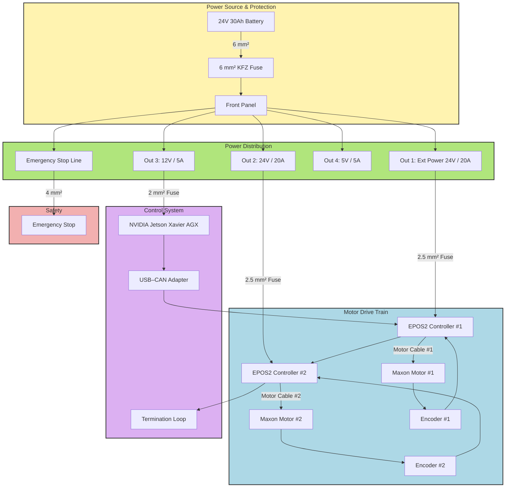

# New Electronics Schematic

# New Volksbot Schematic – Description  

The updated schematic replaces the old pair of lead-acid batteries with a **Booant 24 V / 30 Ah LiFePO₄ battery pack**. This upgrade reduces weight, increases runtime, and simplifies the power system to a single 24 V source. A **50 A DC fuse** is installed close to the battery on the positive line to provide main protection against short circuits. From there, power is routed into the **front distribution panel** through a **Phoenix Contact PC 4/2-STF-7.62 connector**, while the negative lead runs directly to the ground bus.  

  
  
  

Inside the distribution panel, power is split into separate fused outputs:  

- **Out 1 (24 V):** Feeds EPOS2 motor controller #1, protected with a 15 A fuse (can be raised to 20 A if nuisance trips occur).  
- **Out 2 (24 V):** Feeds EPOS2 motor controller #2, also protected with its own 15 A fuse.  
- **Out 3 (24 V):** Reserved for future peripherals, to be fused when needed.  
- **Out 4 (12 V, 5 A):** Supplies the NVIDIA Jetson AGX Xavier (Auvidea X221 carrier board).  
- **Out 5 (5 V, 5 A):** Reserved for future low-voltage peripherals.  

The **emergency stop (E-stop)** line controls the main relay. When pressed, it disconnects the battery from the distribution panel, cutting off all outputs at once — including the Jetson and both motor controllers. This ensures a safe and immediate shutdown.  

On the control side, the **Jetson AGX Xavier** acts as the “brain” of the system. It connects to the two EPOS2 controllers over **CAN bus** using a USB-to-CAN adapter. The adapter connects first to EPOS2 #1 (port J7), which is daisy-chained to EPOS2 #2 (port J8). CAN termination is applied properly: disabled on EPOS2 #1, enabled on EPOS2 #2, and provided on the adapter side. The CAN ground is tied into the system ground at the panel, keeping the communication stable.  

The **motors are unfused** in this design, since each EPOS2 motor controller already provides current and fault protection for its motor output.

  

